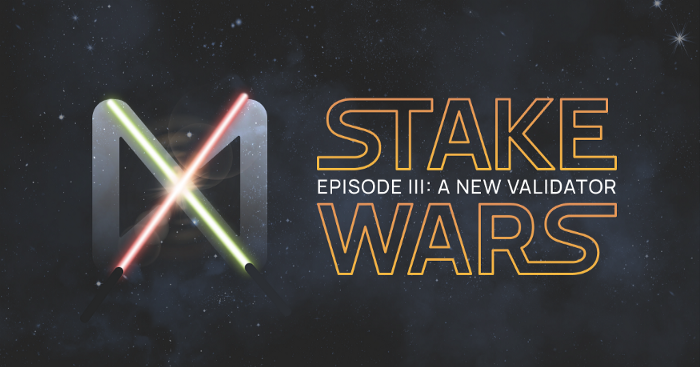
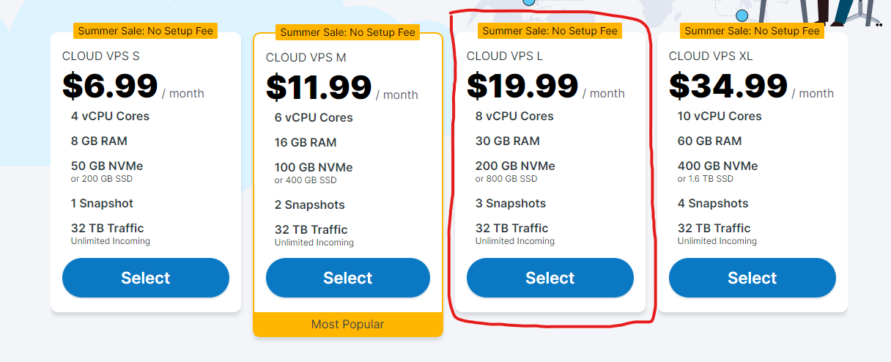
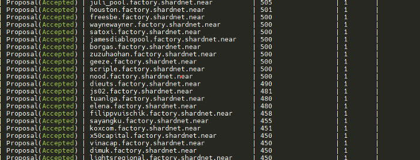

# Challenge 001

* Time: 13/7/202 –9/9/2022



## Hardware Requirement and Cost

I bought VPS pack L with 19.99$/month on contabo



### Hardware:

* CPU — 4-Core CPU with AVX support
* RAM — 8GB DDR4
* Storage 500GB SSD

## Useful Links

Wallet: https://wallet.shardnet.near.org/

Explorer: https://explorer.shardnet.near.org/

### Create a wallet:

https://wallet.shardnet.near.org/

### Setup NEAR-CLI

First, update your Linux to latest

```
sudo apt update && sudo apt upgrade -y
```

Install developer tools, Node.js, and npm
```
curl -sL https://deb.nodesource.com/setup_18.x | sudo -E bash -  
sudo apt install build-essential nodejs
PATH="$PATH"
```
Check node.js version:
```
node -v
```

Check npm version:

```
npm -v
```
### Install NEAR-CLI

```
sudo npm install -g near-cli
```

Create your workplace:

```
export NEAR_ENV=shardnet
echo ‘export NEAR_ENV=shardnet’ >> ~/.bashrc
```

### NEAR CLI Commands Guide

You can check current “proposal” with command:
```
near proposals
```



You can check current “validator” with command:
```
near validators current
```


You can check next “validator” with command:
```
near validators next
```

