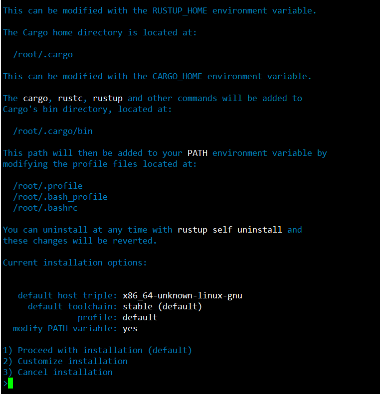

# Challenge 002

## Install packed and Compile nearcore

* Check your machine has the right CPU features
```
lscpu | grep -P '(?=.*avx )(?=.*sse4.2 )(?=.*cx16 )(?=.*popcnt )' > /dev/null \
  && echo "Supported" \
  || echo "Not supported"
```
* Install Python pip
```
sudo apt install python3-pip
```
* Set the configuration:
```
USER_BASE_BIN=$(python3 -m site --user-base)/bin
export PATH="$USER_BASE_BIN:$PATH"
```
* Install Building env
```
sudo apt install clang build-essential make
```
* Install Rust & Cargo
```
curl --proto '=https' --tlsv1.2 -sSf https://sh.rustup.rs | sh
```


=> Press 1 ==> Enter

* Source the environment
```
source $HOME/.cargo/env
```
* Clone nearcore project from Github
```
git clone https://github.com/near/nearcore
cd nearcore
git fetch
```
* Checkout to the latest commit, get latest [commit](https://github.com/near/stakewars-iii/blob/main/commit.md)

* Compile nearcore binary
inside folder nearcore run:
```
cargo build -p neard --release --features shardnet
```


=> Wait until complete
* Next run this command
```
./target/release/neard --home ~/.near init --chain-id shardnet --download-genesis
```
* Replace config Json
```
rm ~/.near/config.json
wget -O ~/.near/config.json https://s3-us-west-1.amazonaws.com/build.nearprotocol.com/nearcore-deploy/shardnet/config.json
```
## Activating the node as validator

* Authorize Wallet Locally
```
near login
```
==> Copy the link in your browser

==> Grant access to NEAR CLi

==> After Grant, you will see this page

==> Enter your wallet, then press enter


* Copy the file generated to shardnet folder: Make sure to replace <pool_id> by your accountId

```
cp ~/.near-credentials/shardnet/YOUR_WALLET.json ~/.near/validator_key.json
```
* Edit “account_id” => xx.factory.shardnet.near, where xx is your PoolName
* Change private_key to secret_key
```
{
  "account_id": "xx.factory.shardnet.near",
  "public_key": "ed25519:HeaBJ3xLgvZacQWmEctTeUqyfSU4SDEnEwckWxd92W2G",
  "secret_key": "ed25519:****"
}
```

* Setup Systemd Command:
```
sudo vi /etc/systemd/system/neard.service
```

paste content:
```
[Unit]
Description=NEARd Daemon Service
[Service]
Type=simple
User=<USER>
#Group=near
WorkingDirectory=/home/<USER>/.near
ExecStart=/home/<USER>/nearcore/target/release/neard run
Restart=on-failure
RestartSec=30
KillSignal=SIGINT
TimeoutStopSec=45
KillMode=mixed
[Install]
WantedBy=multi-user.target
```

> Note: Change USER to your paths

* Enable Near Service
```
sudo systemctl enable neard
```
* Start Near Service
```
sudo systemctl start neard
```
* Watch log
```
sudo apt install ccze
journalctl -fu neard | ccze -A
```


 # Next Challenge
 [Chanllenge003](challenge003.md)